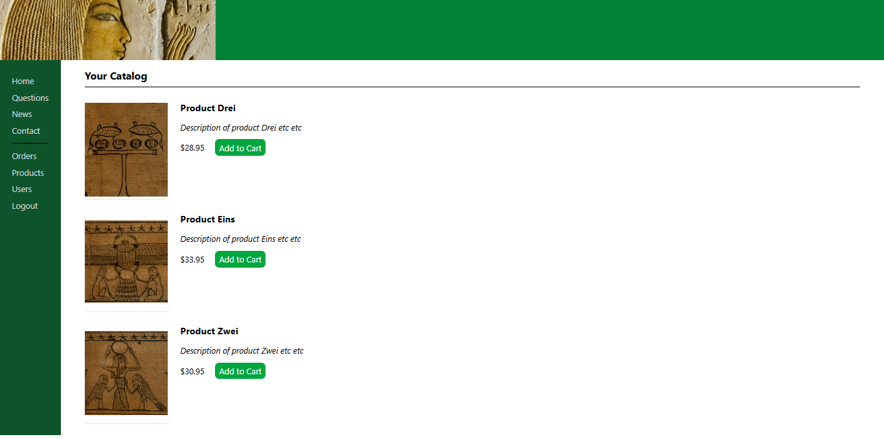

# Store App

Simple store app made mainly by following Agile Web Development with Rails 7 to an extent

## Tech Stack

- **Ruby**: 3.3.8
- **Rails**: 8.0
- **Sqlite3**
- **PostgreSQL** *for production*
- **TailwindCSS**
- **WSL2** with Ubuntu as development environment

---
## Screenshots



## Features

- Product listing and details
- Shopping cart functionality
- Checkout process
- Basic admin panel for managing products


###  Local Setup

Clone the repository:

```bash
git clone https://github.com/amromran/simple_store.git
cd depot
```

### Deployment

Deployed locally with Docker


---

### References

```markdown
- [Agile Web Development with Rails 7]
- [Ruby on Rails Guides](https://guides.rubyonrails.org/)
```